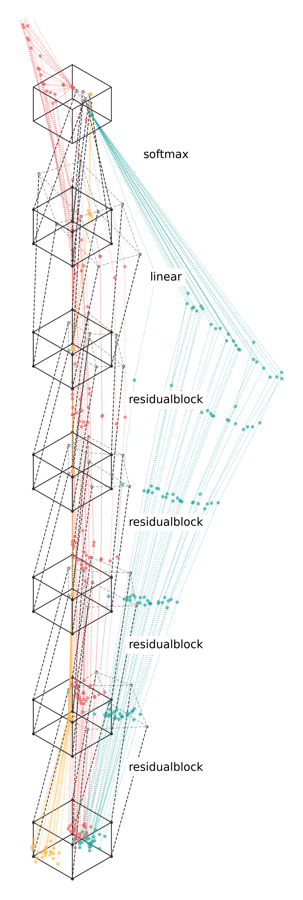

# plot-net
Tools for visualizing neural nets.

## Setup (on mac/linux)
```
git clone git@github.com:phillipi/plot-net.git
cd plot-net

python3 -m venv venv
source venv/bin/activate
pip install torch matplotlib numpy plotly
```

## Usage
`python plot-net.py --which_dataset <dataset_name> --which_model <model_name> --d <2,3> --train <True, False> --viz_type <static, movie>`

* `dataset_name`: See `mk_dataset` in `datasets.py` for options.
* `model_name`: See `mk_model` in `models.py` for options.
* `d`: dimensionality of the data (and width of the model); supported options are 2 or 3; most datasets and models should automatically scale to the specified d.
* `train`: train the net or just run it from init? 
* `viz_type`: `static` runs one forward pass and outputs an image of the embeddings; `training_movie` trains the model on the data and outputs a movie of the embeddings over training iters.
* `renderer`: `matplotlib`, `plotly`, or `threejs`
* See `plot-net.py` for additional command line arguments.

For `threejs` visualization, the webpage files are saved to `./threejs/`. You may need an http server. You can run one locally like:
```
python3 -m http.server 8000
```
Then navigate your browser to http://localhost:8000/.

## Examples

### 1) Run a model on some 2D data and visualize the embeddings as an image:

`python plot-net.py --which_dataset gaussian_data --which_model linear --d 2 --viz_type static`

Output:

<div align="center">
  
</div>

### 2) Train a model on some 2D data and visualize the evolution of the embeddings over iters as a movie:

`python plot-net.py --which_dataset binary_classification --which_model MySimpleNet --d 2 --train True --viz_type movie --N_viz_iter 60 --N_train_iter_per_viz 150`

Output (click to play the video):

<div align="center">
  <a href="https://web.mit.edu/phillipi/www/plot-net/MySimpleNet.mp4"></a>
</div>

### 3) Train a model on some 3D data and visualize the evolution of the embeddings over iters as a movie, with rotating camera:

`python plot-net.py --which_dataset ternary_classification --which_model SimpleResnet --d 3 --train True --viz_type movie --rotate_camera True`

Output (click to play the video):

<div align="center">
  <a href="https://web.mit.edu/phillipi/www/plot-net/SimpleResnet.mp4"></a>
</div>


