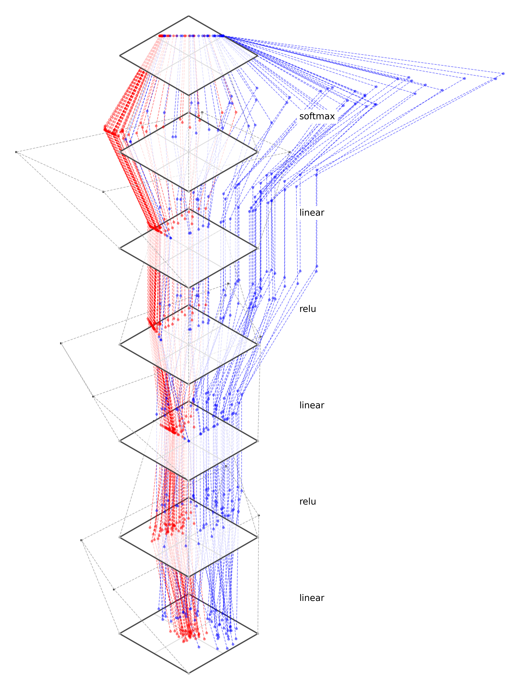

# plot-net
Tools for visualizing neural nets.

## Setup (on mac/linux)
```
git clone git@github.com:phillipi/plot-net.git
cd plot-net

python3 -m venv venv
source venv/bin/activate
pip install torch matplotlib numpy
```

## Usage
`python plot-net.py --which_dataset <dataset_name> --which_model <model_name> --viz_type <static, training_movie>` --d 2

* `dataset_name`: See `mk_dataset` in `datasets.py` for options.
* `model_name`: See `mk_model` in `models.py` for options.
* `viz_type`: `static` runs one forward pass and outputs an image of the embeddings; `training_movie` trains the model on the data and outputs a movie of the embeddings over training iters.
* `d`: dimensionality of the data (and width of the model); supported options are 2 or 3; most datasets and models should automatically scale to the specified d.
* See `plot-net.py` for additional command line arguments.

## Examples

### 1) Run a model on some 2D data and visualize the embeddings as an image:

`python plot-net.py --which_dataset gaussian_data --which_model linear --viz_type static`

Output:

<div align="center">
  
</div>

### 2) Train a model on some 2D data and visualize the evolution of the embeddings over iters as a movie

`python plot-net.py --which_dataset binary_classification --which_model MySimpleNet --viz_type training_movie`

Output (click to play the video):

<div align="center">
  <a href="https://web.mit.edu/phillipi/www/plot-net/MySimpleNet.mp4"></a>
</div>

### 3) Train a model on some 2D data and visualize the evolution of the embeddings over iters as a movie

`python plot-net.py --which_dataset binary_classification --which_model MySimpleNet --viz_type training_movie`

Output (click to play the video):

<div align="center">
  <a href="https://web.mit.edu/phillipi/www/plot-net/SimpleResnet_1.mp4"></a>
</div>


